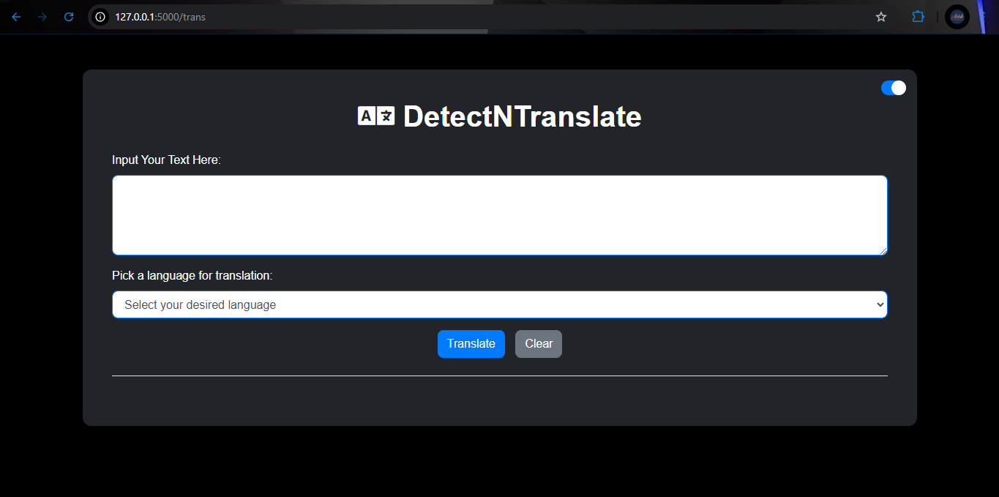
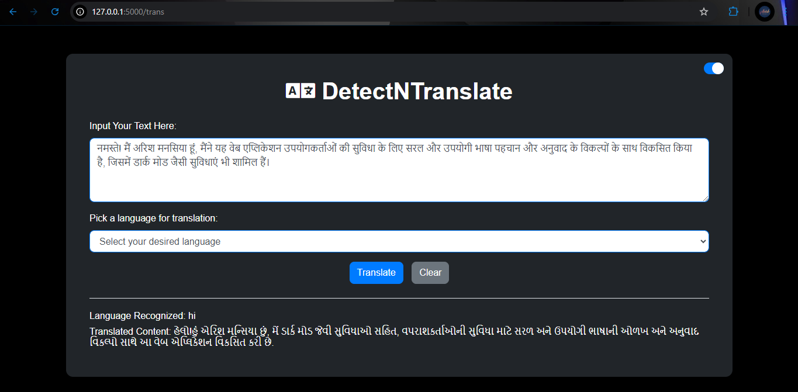

# 🌐 DetectNTranslate

Welcome to **DetectNTranslate**! This is a web application that allows users to detect the language of a given text and translate it into their desired language effortlessly. 

## 📖 Project Description

**DetectNTranslate** is designed to simplify the language detection and translation process for users from diverse linguistic backgrounds. 🌍 Whether you are a student, traveler, or simply curious about languages, this application provides a straightforward solution for quickly understanding and translating text. ✈️📚

### Key Features:

- **Language Detection** 🔍: The application employs advanced algorithms to automatically identify the language of the input text, making it easier for users to translate without prior knowledge of the language.
  
- **Translation** 🌐: Once the language is detected, users can select a target language from a dropdown menu to translate the text, enabling seamless communication and comprehension across different languages.

- **User-Friendly Interface** 👩‍💻: The application boasts a clean and intuitive interface that enhances user experience, making it accessible for everyone, regardless of their technical expertise.

- **Dark Mode** 🌙: Users can toggle between light and dark themes to enhance readability according to their preferences, making it comfortable to use in various lighting conditions.


DetectNTranslate leverages the power of the Google Translate API for accurate translations and supports a wide range of languages, making it a versatile tool for anyone seeking to bridge the communication gap.

---

## ⚙️ Technologies Used

- 💻 **Frontend**: HTML, CSS, JavaScript, Bootstrap
- ⚙️ **Backend**: Flask (Python)
- 🔗 **APIs**: Google Translate API

## 🚀 Getting Started

To get a local copy up and running, follow these simple steps:

1. **Clone the repo**:
   ```bash
   git clone https://github.com/yourusername/DetectNTranslate.git


2. **Navigate to the project directory**:
   ```bash
   cd DetectNTranslate

3. **Install the required packages**:
   ```bash
   pip install -r requirements.txt

4. **Run the application:**:
   ```bash
   python app.py

5. **Open your browser** and go to http://127.0.0.1:5000 to see the application in action!


## 🌟 Usage
1. Enter the text you want to detect and translate.
2. Select the target language from the dropdown menu.
3. Click the "Translate" button to see the results.
4. Use the "Clear" button to reset the form if needed.


## 📱 Screenshots





## 🛠️ Contributing
Contributions are welcome! If you have suggestions for improvements or new features, feel free to create an issue or submit a pull request. We appreciate all contributions to make DetectNTranslate even better.

## 📫 Contact
If you have any questions or feedback, feel free to reach out:

 - Email: arish.manasia2003@gmail.com
- GitHub: arish2003


## Author ✍️

Developed by **Arish Manasia**. Feel free to reach out with any questions or suggestions!

---

Thank you for using **DetectNTranslate**! Enjoy translating! 🌟
